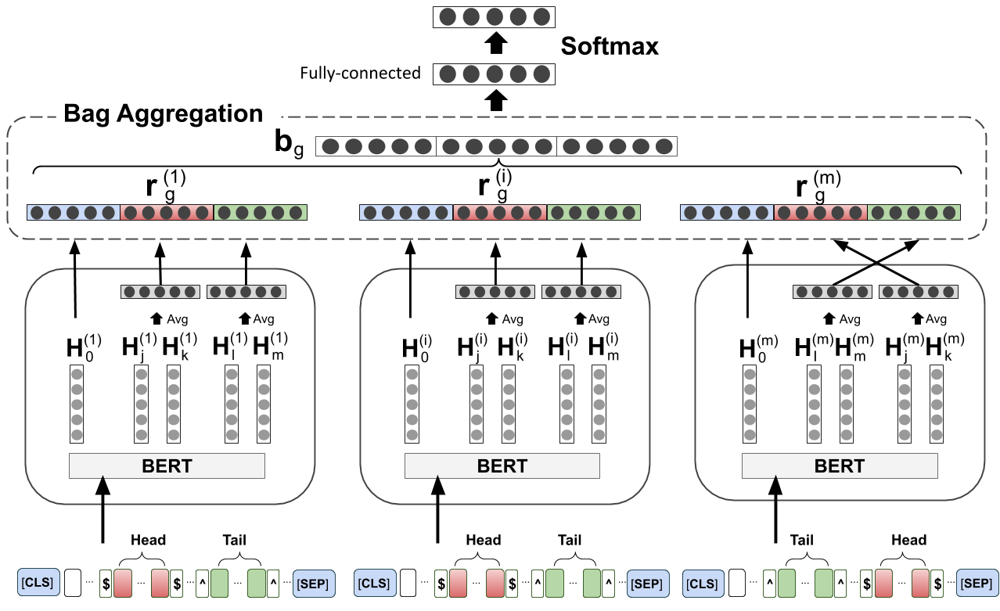

# UMLS-MEDLINE Biomedical Distant RE for Bag-level Multiple Instance Learning

Code for the paper BioNLP 2020 paper *A Data-driven Approach for Noise Reduction in Distantly Supervised Biomedical Relation Extraction*.

## Requirements
`pip install -r requirements.txt`

## Data
To run the code, please obtain the data as follows:

##### UMLS
Install the UMLS tools by following the steps [here](http://blog.appliedinformaticsinc.com/getting-started-with-metamorphosys-the-umls-installation-tool/). Once installed, under `INSTALLED_DIR/2019AB/META`, you can find `MRREL.RRF` and `MRCONSO.RRF`, copy the files and place under `data/UMLS`.

##### MEDLINE
Download MEDLINE abstracts `medline_abs.txt` (~24.5GB) and place under `data/MEDLINE`.

##### Data Creation
1. From project base dir, call the script to process UMLS as: `python -m data_utils.process_umls`. This will create an object `data/umls_vocab.pkl`.
2. Next, run the script `python -m data_utils.extract_unique_sentences_medline`. This might take a while. This will create a file `data/MEDLINE/medline_unique_sentences.txt`.
3. Link the entities with texts: `python -m data_utils.link_entities` (see `config.py` to adjust linking settings).

##### Data Splits
To reproduce the data splits used reported in the paper for `k-tag` setting, run wit default options as `python -m data_utils.create_split`. This will take a while for the first time because of generating the one time file `data/MEDLINE/linked_sentences_to_groups.jsonl`. For next runs, it will use the cached version. For `s-tag`, set the flag `k_tag=False` in `config.py`. For `s-tag+exprels`, additionally set the flag `expand_rels=True`.

## Features
Run `python -m data_utils.features`. Running the job with multi-processing will be significantly faster.

## Train
Run `python train.py`.

#### Checkpoint
Download the best model checkpoint [here](https://cloud.dfki.de/owncloud/index.php/s/9Coe2Hw6zBxjrJo).